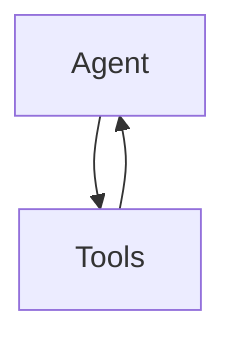

# 📊 Step-by-Step Visualization Code Walkthrough

This document walks through the visualization script line by line, explaining what happens and where the code is located.

---

## 📁 File Locations

- **Visualization Script**: `backend/langgraph-voice-call-agent/visualize_graph.py`
- **Agent Definition**: `backend/langgraph-voice-call-agent/src/langgraph/agent.py`

---

## 🔍 Step-by-Step Execution

### **Step 1: Imports and Setup**

**Location**: `visualize_graph.py` lines 10-18

```python
import os
from dotenv import load_dotenv
from langchain_core.runnables.graph import MermaidDrawMethod

# Load environment variables
load_dotenv()

# Import the agent
from src.langgraph.agent import agent
```

**What's happening:**
1. **`load_dotenv()`** - Loads environment variables from `.env` file (needed for OpenAI API key)
2. **`MermaidDrawMethod`** - Import the method for generating PNG diagrams via Mermaid API
3. **`from src.langgraph.agent import agent`** - Imports the compiled LangGraph agent

**The `agent` object** comes from `src/langgraph/agent.py` line 108-129:
```python
agent = create_react_agent(
    model=ChatOpenAI(model="gpt-4.1-nano"),
    tools=[add_todo, list_todos, complete_todo, delete_todo],
    prompt="""You are a helpful todo list manager...""",
    name="todo_agent"
)
```

**Key Point**: `create_react_agent()` returns a **compiled LangGraph** object that has methods like `get_graph()` and `draw_mermaid_png()`.

---

### **Step 2: Main Function Entry Point**

**Location**: `visualize_graph.py` lines 123-124

```python
if __name__ == "__main__":
    visualize_graph()
```

**What's happening:**
- When you run `uv run python visualize_graph.py`, Python executes `visualize_graph()`

---

### **Step 3: Get the Graph Structure**

**Location**: `visualize_graph.py` lines 30-31

```python
# Get graph structure
graph_structure = agent.get_graph()
```

**What's happening:**
1. **`agent`** is the compiled LangGraph from `create_react_agent()`
2. **`.get_graph()`** is a LangGraph method that returns the internal graph structure
3. **`graph_structure`** now contains:
   - **`.nodes`** - List of all nodes in the graph (e.g., `["agent", "tools"]`)
   - **`.edges`** - List of connections between nodes (may be empty for ReAct agents)
   - **`.draw_mermaid_png()`** - Method to generate PNG visualization

**Behind the scenes:**
- `create_react_agent()` internally creates a graph with nodes like:
  - `"agent"` - The main reasoning node
  - `"tools"` - The tool execution node
- The graph uses **dynamic routing** (edges determined at runtime based on tool calls)

---

### **Step 4: Print Graph Nodes**

**Location**: `visualize_graph.py` lines 33-37

```python
print("Graph Nodes:")
print("-" * 60)
for node_name in graph_structure.nodes:
    print(f"  • {node_name}")
print()
```

**What's happening:**
- Iterates through all nodes in the graph
- Prints each node name (e.g., `"agent"`, `"tools"`)

**Example Output:**
```
Graph Nodes:
------------------------------------------------------------
  • agent
  • tools
```

---

### **Step 5: Print Graph Edges**

**Location**: `visualize_graph.py` lines 39-48

```python
print("Graph Edges:")
print("-" * 60)
if hasattr(graph_structure, 'edges') and graph_structure.edges:
    for edge in graph_structure.edges:
        source = getattr(edge, 'source', '?')
        target = getattr(edge, 'target', '?')
        print(f"  {source} → {target}")
else:
    print("  (Edges are dynamically determined by the ReAct pattern)")
print()
```

**What's happening:**
1. Checks if the graph has explicit edges
2. If yes: prints each edge (source → target)
3. If no: prints a message explaining that ReAct agents use dynamic routing

**Why edges might be empty:**
- ReAct agents use **conditional routing** - the path depends on whether the agent decides to call tools
- The graph structure is: `agent → (condition) → tools → agent` (loop)
- This routing happens at runtime, not as static edges

---

### **Step 6: Generate Mermaid Diagram Text**

**Location**: `visualize_graph.py` lines 50-54

```python
# Try to generate Mermaid diagram
print("Mermaid Diagram (copy to https://mermaid.live/ or use in Markdown):")
print("-" * 60)
mermaid = generate_mermaid_diagram(graph_structure)
print(mermaid)
print()
```

**What's happening:**
- Calls `generate_mermaid_diagram()` function (defined at line 96)
- Prints the Mermaid diagram text
- Mermaid is a text-based diagram language that can be rendered visually

---

### **Step 7: The `generate_mermaid_diagram()` Function**

**Location**: `visualize_graph.py` lines 96-121

```python
def generate_mermaid_diagram(graph):
    """Generate a Mermaid diagram from the graph."""
    lines = ["graph TD"]  # TD = Top Down layout
    
    # Add nodes
    for node_name in graph.nodes:
        # Format node names nicely
        display_name = node_name.replace("_", " ").title()
        lines.append(f'    {node_name}["{display_name}"]')
    
    # Add edges if available
    if hasattr(graph, 'edges') and graph.edges:
        for edge in graph.edges:
            source = getattr(edge, 'source', None)
            target = getattr(edge, 'target', None)
            if source and target:
                lines.append(f"    {source} --> {target}")
    else:
        # For ReAct agents, edges are typically:
        # agent -> tools -> agent (loop)
        lines.append("    %% ReAct pattern: agent <-> tools (dynamic routing)")
        if "agent" in graph.nodes:
            lines.append('    agent --> tools["Tools"]')
            lines.append('    tools --> agent')
    
    return "\n".join(lines)
```

**What's happening step by step:**

1. **Line 98**: `lines = ["graph TD"]`
   - Creates a list starting with Mermaid syntax for a top-down graph

2. **Lines 101-104**: Add nodes
   - Loops through each node in the graph
   - Formats the name (e.g., `"agent"` → `"Agent"`)
   - Adds Mermaid node syntax: `agent["Agent"]`

3. **Lines 106-112**: Add edges if they exist
   - If the graph has explicit edges, adds them to the diagram

4. **Lines 113-119**: Fallback for ReAct pattern
   - If no explicit edges (common for ReAct agents), manually adds:
     - `agent --> tools` (agent calls tools)
     - `tools --> agent` (tools return to agent)
   - This creates a loop representing the ReAct pattern

5. **Line 121**: `return "\n".join(lines)`
   - Joins all lines with newlines to create the complete Mermaid diagram

**Example Output:**


---

### **Step 8: Save Mermaid Diagram to File**

**Location**: `visualize_graph.py` lines 57-60

```python
# Save to file
with open("graph_visualization.mmd", "w") as f:
    f.write(mermaid)
print("✅ Saved Mermaid diagram to: graph_visualization.mmd")
```

**What's happening:**
- Opens `graph_visualization.mmd` for writing
- Writes the Mermaid diagram text
- Saves it so you can:
  - View it later
  - Copy to https://mermaid.live/
  - Use in Markdown files (GitHub, etc.)

---

### **Step 9: Generate PNG Image (The Key Step!)**

**Location**: `visualize_graph.py` lines 63-78

```python
# Generate PNG using LangGraph's built-in method
try:
    print("Generating PNG visualization...")
    graph_image = graph_structure.draw_mermaid_png(draw_method=MermaidDrawMethod.API)
    if graph_image:
        with open("graph_visualization.png", "wb") as f:
            f.write(graph_image)
        print("✅ Saved PNG visualization to: graph_visualization.png")
    else:
        print("⚠️  PNG generation returned empty data")
except AttributeError:
    print("💡 PNG export not available for this graph type")
    print("   The graph structure is available above as Mermaid diagram")
except Exception as e:
    print(f"⚠️  Could not generate PNG: {e}")
    print("   You can still use the Mermaid diagram above")
```

**What's happening step by step:**

1. **Line 66**: `graph_structure.draw_mermaid_png(draw_method=MermaidDrawMethod.API)`
   - **`graph_structure`** - The graph object from `agent.get_graph()`
   - **`.draw_mermaid_png()`** - LangGraph's built-in method to generate PNG
   - **`draw_method=MermaidDrawMethod.API`** - Uses Mermaid's web API to render the diagram
     - This means it sends the Mermaid text to Mermaid's servers
     - They render it and return a PNG image
     - No local Graphviz installation needed!

2. **Line 67-70**: Save the PNG
   - `graph_image` contains binary PNG data (bytes)
   - Opens `graph_visualization.png` in **binary write mode** (`"wb"`)
   - Writes the PNG bytes to the file

3. **Error Handling**:
   - If the method doesn't exist: catches `AttributeError`
   - If something else fails: catches general `Exception`
   - Provides helpful fallback messages

**Why `MermaidDrawMethod.API`?**
- **Alternative**: `MermaidDrawMethod.PYPPETEER` (requires local browser)
- **API method**: No local dependencies, works anywhere with internet
- Sends Mermaid text → Mermaid API → Returns PNG bytes

---

### **Step 10: Print Graph Information**

**Location**: `visualize_graph.py` lines 80-86

```python
print()
print("Graph Information:")
print("-" * 60)
print(f"  Number of nodes: {len(graph_structure.nodes)}")
if hasattr(graph_structure, 'edges'):
    print(f"  Number of edges: {len(graph_structure.edges)}")
print(f"  Graph type: ReAct Agent (created with create_react_agent)")
print()
```

**What's happening:**
- Prints summary statistics about the graph
- Shows node count, edge count (if available), and graph type

---

### **Step 11: Error Handling**

**Location**: `visualize_graph.py` lines 89-94

```python
except Exception as e:
    print(f"❌ Error visualizing graph: {e}")
    print()
    print("Alternative: Use LangGraph Studio")
    print("  Run: langgraph studio")
    print("  Then open: http://localhost:8123")
```

**What's happening:**
- Catches any errors that occur during visualization
- Provides helpful alternative (LangGraph Studio)

---

## 🔄 Complete Flow Diagram

```
┌─────────────────────────────────────────┐
│ 1. Import agent from agent.py           │
│    agent = create_react_agent(...)      │
└──────────────┬──────────────────────────┘
               │
               ▼
┌─────────────────────────────────────────┐
│ 2. Get graph structure                   │
│    graph_structure = agent.get_graph()   │
└──────────────┬──────────────────────────┘
               │
               ▼
┌─────────────────────────────────────────┐
│ 3. Extract nodes and edges              │
│    nodes = graph_structure.nodes        │
│    edges = graph_structure.edges        │
└──────────────┬──────────────────────────┘
               │
               ▼
┌─────────────────────────────────────────┐
│ 4. Generate Mermaid text                │
│    mermaid = generate_mermaid_diagram() │
└──────────────┬──────────────────────────┘
               │
               ├──► Save to .mmd file
               │
               ▼
┌─────────────────────────────────────────┐
│ 5. Generate PNG image                   │
│    PNG = graph.draw_mermaid_png(API)     │
│    (Uses Mermaid API to render)        │
└──────────────┬──────────────────────────┘
               │
               ▼
┌─────────────────────────────────────────┐
│ 6. Save PNG to file                     │
│    graph_visualization.png               │
└─────────────────────────────────────────┘
```

---

## 🎯 Key Concepts

### **What is `agent.get_graph()`?**

**Location**: This is a method on the compiled LangGraph object

**What it returns:**
- A graph structure object with:
  - `.nodes` - List of node names
  - `.edges` - List of edge objects (may be empty)
  - `.draw_mermaid_png()` - Method to generate PNG

**Where it comes from:**
- `create_react_agent()` in `langgraph.prebuilt` creates a compiled graph
- This graph has the `get_graph()` method built-in

### **What is `MermaidDrawMethod.API`?**

**Location**: `langchain_core.runnables.graph.MermaidDrawMethod`

**What it does:**
- Tells `draw_mermaid_png()` to use Mermaid's web API
- Sends Mermaid text → Mermaid servers → Returns PNG bytes
- No local dependencies needed

**Alternative:**
- `MermaidDrawMethod.PYPPETEER` - Uses local browser (requires pyppeteer)

### **Why ReAct Agents Have Dynamic Routing?**

**Location**: `src/langgraph/agent.py` line 108

```python
agent = create_react_agent(...)
```

**What this means:**
- The agent decides at runtime whether to call tools
- Graph structure: `agent → (condition) → tools → agent`
- The condition is: "Does the agent want to call a tool?"
- This is why edges might be empty - routing is dynamic!

---

## 📝 Summary

1. **Import** the compiled agent from `agent.py`
2. **Get graph structure** using `agent.get_graph()`
3. **Extract nodes** and print them
4. **Extract edges** (may be empty for ReAct agents)
5. **Generate Mermaid text** using custom function
6. **Save Mermaid** to `.mmd` file
7. **Generate PNG** using `draw_mermaid_png(MermaidDrawMethod.API)`
8. **Save PNG** to `.png` file
9. **Print summary** information

The key insight: **`create_react_agent()` returns a compiled graph with built-in visualization methods!**

